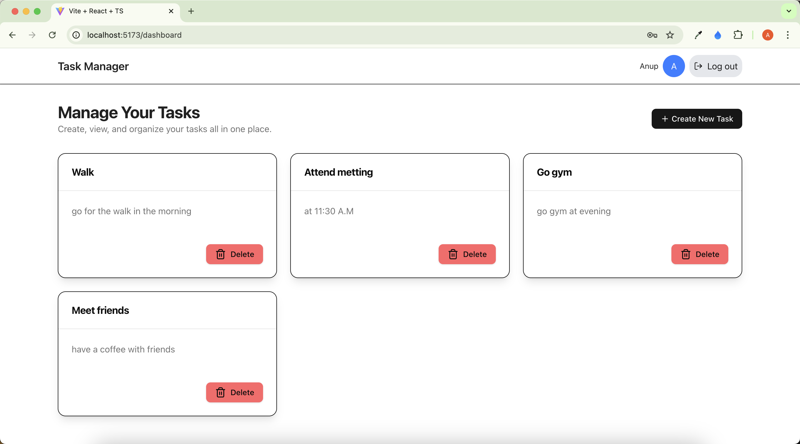

# 📝 Task Manager Frontend

This is the frontend for the **Task Manager App**, built using **Vite + React**. It connects to the backend REST API (Node.js + Express + PostgreSQL) and supports full user authentication (JWT with access and refresh tokens) and task management functionality.

---

## 📸 Screenshot



---

## ⚙️ Features

- 🔒 User registration & login
- 🔁 JWT-based access & refresh token handling
- ✅ Protected routes with auto-refresh logic
- 📋 Task CRUD operations (Create, Read, Update, Delete)
- 🍪 Secure cookie/session handling

---

## 🚀 Getting Started

### 1. Clone the Repository

```bash
git clone https://github.com/anupRanaMagar/taskmanagerfrontend.git
cd task-manager-frontend
```

### 2. Install Dependencies

```bash
npm install
```

### 3. Set Up Environment Variables

Create a `.env` file in the root and configure it like this:

```env
BACKEND_ROUTE = your_backend_root_route
```

> This should point to your backend API URL.

---

## 🧪 Run the App Locally

```bash
npm run dev
```

The app should now be running at: [http://localhost:5173](http://localhost:5173)

---

## 🔧 Technologies Used

- **Vite** (React boilerplate)
- **React + TypeScript**
- **Axios** (HTTP requests)
- **React Router**
- **Tailwind CSS** (or your preferred styling lib)
- **jwt-decode** (to decode access tokens)

---

## 📂 Backend API

Make sure the [Task Manager API backend](https://github.com/anupRanaMagar/taskmanagerbackend) is running and configured to handle CORS and cookies properly.

---
